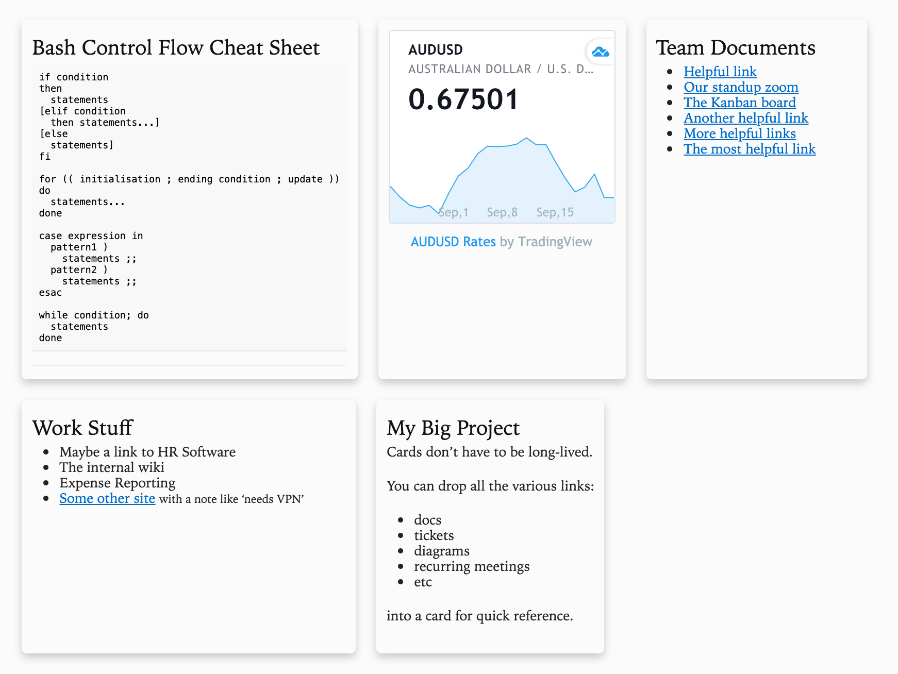

# DIY landing pages

## Custom new tab page microframework

A small bit of CLI plumbing to make a custom new tab page with the information *you* want.

## How To

* Clone this repo
* Add content in `cards/`: Markdown ending in `.md` or HTML ending in `.html`
* Run `make`
* Configure your browser to use `index.html` as the new tab page, perhaps using the [New Tab Redirect](https://chrome.google.com/webstore/detail/new-tab-redirect/icpgjfneehieebagbmdbhnlpiopdcmna) extension

## Dependencies

* [gomplate](https://github.com/hairyhenderson/gomplate): Golang simple template tool
* [Pandoc](https://pandoc.org/)
* Make
